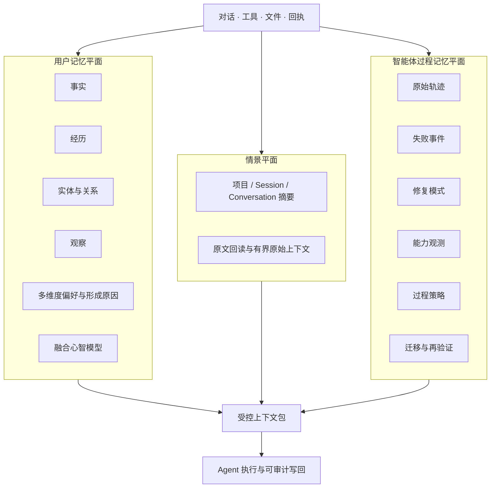

# 中文说明

> English version: [README.md](README.md)

> **让 Agent 不只是记得过去，还知道哪些是真的、哪些只是候选，以及下一步应该如何更可靠地行动。**

EP 5.0 是一个面向 AI Agent 的证据型记忆控制平面：它把用户知识、智能体过程经验、外部资料和本轮执行链路分开管理，再通过可审计的路由和回执把它们安全地组合起来。

## 一句话理解

普通记忆系统往往回答“这段内容像不像以前见过”；EP 还会继续回答：

- 这到底是事实、经历、实体、偏好、情景，还是智能体自己的过程经验？
- 是 User Recall、User Research、User Preference、Agent Recall，还是外部 RAG 找到的？
- 候选是否真的返回、送达、回读过原文？
- 这个经验是否经过验证，是否适合当前模型、当前项目和当前阶段？

因此 EP 不是简单扩大向量库，而是把“记忆、证据、路由、执行和审计”放进同一个可解释的控制平面。

## 常见记忆机制为什么会失真

很多记忆系统的起点都很合理：保存对话、生成向量、召回最相似的内容。但真正困难的问题往往发生在下一层。

### 1. 用户知识和智能体经验混在一起

用户的偏好、项目事实、个人经历，和 Agent 某次工具调用失败、调试绕路、交付教训并不是同一种记忆。如果都只是一个“memory”对象，智能体可能把临时修复方案误当成用户偏好，把某个项目的局部决定误当成普遍事实。

### 2. 一个提取出来的事实不等于完整意义

高质量的用户记忆需要多个互补视角：

- **事实**描述状态、规则、主张和约束；
- **经历**保留谁在何时、什么条件下做了什么以及结果如何；
- **实体与关系**连接人、项目、组织、工具和文件；
- **观察**从多条证据归纳重复模式，不能把一次事件直接升级为规律；
- **多维度偏好**区分沟通、解释、决策、执行、交付、权限和验收，并保留适用条件、例外以及形成原因或证据；
- **融合心智模型**解释跨记录的稳定模式，但不能替代底层来源。

### 3. 提取正确也可能因为缺少情景而用错

“采用简洁结构”或“项目 X 使用供应商 Y”可能本身正确，但如果当前 Session、Conversation 或 Project 情况不同，直接使用仍然会错。每次读取完整历史会慢、费 Token，也很难并行；只读取压缩摘要又可能丢失关键约束。EP 因此建立情景摘要索引，按缺口选择 compact、standard、full、有界的 Session/Project 原始上下文，或直接回读来源。

### 4. 智能体经验需要独立维度和生命周期

Agent 不只是输出文字，还会规划、调用工具、观察失败、修复代码、验证结果、管理上下文和交付文件。这些经验需要独立的过程维度和成熟度。否则一次“看起来成功”的回答可能在没有独立验证时就被升级，某个模型的临时绕路也可能被强行套用到未来更强的模型上。

### 5. 分得越细也可能带来新问题

目标不是无条件地把所有东西都拆得最细。所有提炼器都常驻，会增加延迟、Token 消耗和路由混乱。EP 把各维度做成可配置模块，配合依赖关系、候选预算、逐层下钻和明确的“未观测”状态：结构可以很丰富，但每轮只付出当前任务需要的成本。

## EP 的答案：分层记忆，但不割裂推理



这些平面在存储和检索上并行，但最终在受控上下文包处汇合。平衡点就是：**记忆对象更精确，决策入口仍然统一**。

## 个性化不是妥协，而是 EP 的能力

部署者可以按照自己的场景和 Token 预算选择开启哪些机制：

- 独立开关事实、经历、实体、偏好、情景摘要、原文回读和后台反思；
- 独立开关智能体轨迹、观察、失败事件、修复模式、能力、策略和再验证；
- 为偏好、情景、原文回读、EP 检索和外部 RAG 设置不同 Token 预算；
- 可以保留写入，但暂时关闭某一模块的检索或注入；
- 简单任务保持轻量，跨项目调查再按需扩大候选和下钻范围。

最终目标不是“每个 Prompt 都注入最多记忆”，而是**为当前任务选择最小但足够的记忆路线，并用回执说明实际发生了什么**。

## 真实链路监测

EP 把可观测性作为记忆契约的一部分，而不是事后加上的日志页：

```text
未调用 ≠ 调用但为空 ≠ 返回候选 ≠ 已送达 ≠ 已回读原文 ≠ 已确认答案采用
```

每个节点都可以打开详情卡，查看路由名称、时间、候选数、返回数、送达数、来源 ID、回读数、Fallback 来源和未决边界。这样可以准确定位“记忆其实相关，但没有送到 Agent”之类的问题，而不是只看最终回答猜测。

## 感谢 Hindsight，并在其基础上独立发展

EP 最初受 Hindsight 在 retain/recall/reflect、Memory Bank、观察、实体和长期智能体记忆方面的实践与公开研究启发。我们感谢 Hindsight 项目及相关研究者把这条方向做得具体、可运行、可检验。EP 5.0 在此基础上继续发展独立的控制平面：用户记忆与智能体过程记忆分离、情景感知路由、可配置模块、外部 RAG 隔离以及回执级执行观测。署名和边界见 [`NOTICE.md`](NOTICE.md)。

## EP 5.0 的核心卖点

1. **用户记忆与智能体记忆分层**：用户事实、经历、实体、偏好和情景摘要不会与 Agent 的失败事件、修复模式、能力观测混成一团。
2. **检索结果可对账**：链路页分别显示候选、返回、送达、原文回读和答案采用状态，避免“调用了但不知道送没送到”。
3. **经验会验证，也会降级**：过程模式和技能候选必须有证据、范围、反例和再验证记录；新模型变强后，旧经验可以降低干预等级或废弃。
4. **外部 RAG 与内部记忆隔离**：外部 PDF/Word/Markdown 资料可以用混合检索，但不会自动污染 EP 长期记忆。
5. **把整个运行过程画出来**：串行主干、并行路线、分支、汇聚、上下文包、写回和审计都能在拓扑图中查看。

## 如何阅读 5.0

建议先看本 README 的逻辑和边界，再看 [智能体过程记忆 PRD](docs/EP5.0-AGENT-PROCESS-MEMORY-PRD.md)、[完整链路 PRD](docs/EP5.0-FULL-CHAIN-OBSERVABILITY-PRD.md)、[路由契约](docs/EP-ROUTE-CONTRACT.md)和[唯一真相源](config/source-of-truth.json)。这样可以先理解“为什么这样分”，再进入接口和实现细节。

## EP 5.0 是什么

Evolving Profile（EP）是面向 AI Agent 的长期记忆、证据控制和链路观测平面。它不会把一次相似度命中直接当作事实，而是把目录导航、候选召回、原文回读、宿主送达和答案是否采用分别记录。

本发行包是脱敏、可重新初始化的模板，不包含个人 Bank、对话、API Key、私有 Prompt、宿主账号或生产回执。安装后需要创建自己的空 Bank，并自行配置模型、存储位置和外部 RAG 目录。

上方配图是脱敏后的链路页：上方是串行主干，中间是用户记忆、智能体过程记忆和外部 RAG 三条并行路线，随后汇聚到上下文组装、执行、写回、审计和最终回答。每个节点都可以点击查看自己的详细回执。

## 本次 5.0 更新

- 新增独立的智能体过程记忆平面，记录轨迹、失败事件、修复模式、能力观测和再验证，不覆盖用户事实与偏好。
- 链路页改为完整拓扑：串行主干、显式分支/汇聚、三条并行记忆路线、写回和审计全部可见。
- 统一 User Recall、User Research、User Preference、User Scenario Summary、User Source Readback，以及 Agent Recall、Agent Research、Agent Guidance、Agent Observe、Agent Writeback、Agent Evaluation 等路由名称；旧名称保留兼容映射。
- Prompt 详情增加明确的加载状态，区分尚未加载和加载后为空；状态服务超时可以读取本地 Hook 回执，但不会把本地文件搜索伪装成 EP Recall。
- 每个节点只显示自己的候选、返回、送达、原文回读和答案采用状态，修复父节点总数复制到所有子节点的问题。
- 智能体过程记忆支持轨迹、观察、失败事件、修复模式、能力、策略和再验证等模块分别开关。
- 英文作为默认语言，并覆盖简体中文及已有语言；新增界面文本经过多语言检查。
- 外部 RAG 与 EP Bank 隔离，支持词法、向量、RRF、Rerank、索引签名和重建提示；JEV 是可选的后处理判断器，默认关闭并由规则托底。
- 备份支持位置、周期、保留天数、最大套数、最少成功套数、SHA-256 清单和云端镜像核验。
- 建立版本、运行配置、指导配置、备份配置、用户记忆、智能体过程记忆、原始会话和外部 RAG 各自的唯一真相源。

## 运行链路

```text
Prompt 入口 → Hook/宿主绑定 → 任务契约 → 分支
  → 用户记忆：偏好、召回、研究、情景摘要、原文回读
  → 智能体记忆：观察、过程召回/研究、兼容性门控、提示/建议/脚手架/防护
  → 外部 RAG：来源路由、词法+向量、RRF、Rerank、可选 JEV
汇聚 → 上下文组装/Agent 执行 → 用户写回+智能体写回 → 审计 → 最终回答
```

“候选”“已返回”“已送达”“已原文回读”和“答案采用”是不同状态。工具被调用不等于答案使用了结果；返回 0 条也不等于没有调用。

## 用户记忆与情景摘要

用户记忆继续包括事实、经历、实体与关系、观察、多维度偏好、情景摘要和融合心智模型。经历可以关联多个主体和实体，实体也可以参与多条经历，但证据不足时保留未知，不为了图谱完整强行合并。

情景摘要分 compact、standard、full 三层，只用于定位 Project/Session/Conversation 的环境、阶段和约束。金额、版本、人物、状态、原话和冲突等关键内容仍然要回到 `read_source` 或有界的原始会话；不会因为摘要不完整就把整个项目历史一次性注入。

## 智能体过程记忆

过程记忆与用户记忆分开，按以下层级逐步成熟：

```text
P0 轨迹 → P1 事件 → P2 失败事件 → P3 修复模式 → P4 技能候选
```

记录中包含执行阶段、任务族、模型/工具/项目范围、前置条件、反例、验证质量、样本量、时间窗口和再验证记录。Agent 自己说“完成”不能单独把内容升级为技能。对新模型先轻量提示，再依据实际样本动态调整干预强度：观察 → 提示 → 建议 → 脚手架 → 防护。旧经验可以降级、废弃或重新验证，不能压制更强的新模型。

## 外部 RAG、模型和备份

EP Bank 负责用户和过程记忆，外部 RAG 只检索用户指定的 PDF、Word、Markdown 等目录。Embedding、Rerank、RRF、Provider/Fallback 和 JEV 分工独立。模型或维度变化会触发索引重建提示，不会把新旧向量混用。JEV 只做证据充分性、来源路由、故障归因或风险判断，不替代 Recall/Research，也不直接写入事实。

网页端可以配置 Provider/Fallback、用户记忆模块、智能体记忆模块、检索模型、外部 RAG、情景摘要、备份和审计。备份策略支持本地位置、日/周/月周期、保留天数、最大套数、最少成功套数、校验清单和云端镜像分离。

## 安装、验证与边界

需要 macOS/Linux、Python 3.11+、uv、Node.js 20+、npm，以及完整 API 所需的 PostgreSQL；Embedding/Rerank 本地模型和线上模型均可按配置选择。

```bash
cp .env.example .env
cd api && uv sync
cd ../console && npm ci
cd .. && npm run dev
```

发布前运行预检、脱敏检查、Python/TypeScript 测试、生产构建和浏览器视觉交互测试。公开仓库不包含 `~/.evolving-profile`、`~/.codex/sessions`、真实回执、缓存、个人 Bank 或 API Key。

EP 能确认工具调用、候选返回、送达和原文回读，但在宿主没有答案采用回执时，不能声称知道 Agent 最终在回答中采用了哪条记忆。情景摘要、过程模式和 RAG 结果都不能替代原始证据。

本次版本在 `release/5.0.0` 分支准备，已向上游 [`94Hao94/evolving-profile`](https://github.com/94Hao94/evolving-profile) 提交 PR；发行分支位于 [`ccygod/evolving-profile-2.2`](https://github.com/ccygod/evolving-profile-2.2)。GitHub PR、合并、Tag 和 Release 状态分别记录在 [`docs/RELEASE-LEDGER.md`](docs/RELEASE-LEDGER.md)。作者署名、Hindsight 致谢和许可边界见 [`NOTICE.md`](NOTICE.md)。
