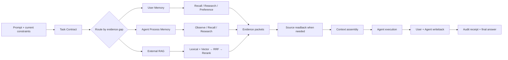

# Evolving Profile 5.0

<div align="center">

**Memory that knows what is true, what was tried, and what the agent should do next.**

Evidence-aware memory for AI agents — with user knowledge, agent process memory, source-grounded retrieval, and a visible execution chain.


<a href="https://github.com/94Hao94/evolving-profile/pull/3">Review the 5.0 contribution</a> ·
<a href="#quick-start">Quick start</a> ·
<a href="#how-ep-thinks">How EP thinks</a> ·
<a href="#why-ep">Why EP</a>

</div>

> **English is the default documentation and UI language. Simplified Chinese documentation follows this English section.**

Evolving Profile (EP) is a long-term memory, evidence, and observability control plane for AI agents. It does not treat a similarity hit as a fact. Instead, it keeps navigation, retrieval, source readback, delivery, and answer-side uncertainty as separate auditable states.

This contribution package is a sanitized, re-initializable distribution. It contains no personal Bank, conversation history, API key, private prompt, hosted account, or production receipt. A new installation starts with an empty user memory store and lets the operator configure its own provider, storage, and external RAG directory.


*The screenshot is a sanitized console view of the serial spine, parallel memory lanes, explicit forks/merges, and receipt-aware packets. The live UI can open a detail card for every node and show its actual candidate, returned, delivered, source-readback, and answer-use state.*

## The short version

Most memory layers answer **“what looks similar?”** EP is built to answer four harder questions:

1. **What kind of knowledge is this?** A fact, an experience, an entity, a preference, a scenario, an external document, or an agent-process lesson?
2. **Which route found it?** User Recall, User Research, User Preference, Agent Recall, Agent Research, or External RAG?
3. **What evidence actually arrived?** Candidate, returned, delivered, source-read, and answer-use are separate states.
4. **Can this lesson be reused safely?** Agent-process patterns carry scope, verifier quality, model compatibility, counterexamples, and revalidation state.

EP is therefore not “a bigger vector database”. It is a **memory control plane**: a system that keeps knowledge, evidence, routing, and execution history understandable to both the agent and the operator.

## Why EP

| If you only add… | You get… | EP adds… |
| --- | --- | --- |
| Conversation memory | A compressed history of what was said | Typed user knowledge with source, time, subject, scope, and lifecycle |
| Vector RAG | Similar chunks | Isolated routes, lexical/vector/RRF/Rerank options, source readback, and delivery receipts |
| A knowledge graph | Connected entities | Graph navigation plus evidence boundaries; an edge is never silently promoted to a fact |
| A task skill library | Reusable instructions | Agent-process episodes that record failure, repair, verifier quality, model compatibility, and revalidation |
| A prompt log | A timeline of calls | A full execution topology showing serial steps, parallel lanes, forks, merges, writeback, and audit |

### The promise

**EP helps an agent remember without making it blindly obey the past.** Current instructions and verified evidence stay above stale preferences or unverified process patterns. A stronger future model is not forced to imitate an older model; a weaker model can receive more structure only when evidence shows that structure helps.

## How EP thinks



The key design choice is the **evidence gap**. EP does not begin with “inject everything that matches”. It begins by asking what is missing: a stable preference, a single historical episode, a cross-session relationship, a source paragraph, or a process lesson. The route and depth follow that gap.

## What makes 5.0 different

5.0 adds the execution side to EP4's user-memory and evidence model:

- User Memory answers **what the user/world/project history contains**.
- Agent Process Memory answers **what an agent tried, where it failed, how it recovered, and how confidently that recovery transfers**.
- External RAG answers **what the operator's external documents say**.
- The topology answers **what actually happened this turn**.

These are deliberately separate planes. They can cooperate in one context packet, but they cannot silently overwrite one another.

## A practical comparison

EP is designed for teams that need both **memory quality** and **operational accountability**. The comparison below describes architectural emphasis, not a claim that other projects cannot be extended.

| Dimension | Conversation-first memory | Retrieval-first RAG | EP 5.0 |
| --- | --- | --- | --- |
| Primary question | What did we say? | Which chunk is similar? | What evidence is relevant, what route found it, and what can be trusted? |
| Memory shape | Usually one compressed history | Documents/chunks and vectors | Facts, Experiences, Entities, Observations, Preferences, Scenarios, Process Episodes, RAG documents |
| Agent execution lessons | Often mixed into history | Usually outside the memory model | Dedicated Agent Process Memory with maturity and compatibility gates |
| Retrieval visibility | Tool call may be opaque | Search score is visible | Candidate → returned → delivered → readback → answer-use states |
| Conflict handling | Model-dependent | Rank-dependent | Scope, time, source, project/session identity, and explicit unresolved state |
| Model evolution | Old summaries may dominate | Old embeddings may drift | Capability calibration, intervention levels, revalidation, downgrade, and deprecation |
| Operator experience | Logs or a memory viewer | Search UI | Full-chain topology, node detail cards, configuration panels, audit receipts |

## Proof, not hype

The 5.0 contribution is backed by a release gate rather than invented product numbers:

- **636** Python Host Adapter / Controller / Guidance / Status tests passed;
- **146** Console tests passed across 23 test files;
- **10** API Hermes template tests passed;
- production Console build, localization scan, release preflight, package verification, and secret/personal-data scan passed;
- the public package contains no personal Bank, private Prompt, API key, local receipt, or machine-specific user path.

The two skipped Python checks depend on a private rollback fixture that is intentionally not distributed. The current contribution is tracked in [PR #3](https://github.com/94Hao94/evolving-profile/pull/3); merge, tag, and GitHub Release are separate states.

## Read the project in this order

1. **This README** — the product idea, logic, boundaries, and quick start.
2. **[EP 5.0 Agent Process Memory PRD](docs/EP5.0-AGENT-PROCESS-MEMORY-PRD.md)** — process-memory model and lifecycle.
3. **[Execution Topology PRD](docs/EP5.0-EXECUTION-TOPOLOGY-PRD.md)** — serial/parallel/fork/merge rules and visual contract.
4. **[Route Contract](docs/EP-ROUTE-CONTRACT.md)** — canonical user and agent routes.
5. **[Source of Truth](config/source-of-truth.json)** — which store is authoritative for which fact.
6. **[Release Notes](docs/RELEASE-NOTES-5.0.0.md)** — migration, limits, and verification evidence.

## What is new in 5.0

This release is the 5.0 architecture and runtime package. It keeps the validated 4.0 user-memory model and compatibility routes, and adds a first-class Agent Process Memory plane plus full-chain execution observability.

- **Agent Process Memory** is a separate memory plane for execution trajectories, failures, repairs, capability observations, conditional patterns, and revalidation. It does not overwrite user facts or preferences.
- **Full-chain topology** presents the serial entry spine, three parallel lanes (User Memory, Agent Process Memory, External RAG), explicit forks and merges, writeback, audit, and final response. Node counts are projected from the node's own receipts instead of copying a parent total into every child.
- **Canonical route names** make the source of a result obvious: `user_recall`, `user_research`, `user_preference`, `user_scenario_summary`, `user_source_readback`, `agent_recall`, `agent_research`, `agent_guidance`, `agent_observe`, `agent_writeback`, and `agent_evaluation`. Legacy tool names remain compatibility aliases.
- **Prompt receipt loading** now shows an explicit loading state and distinguishes “not loaded yet” from “loaded and empty”. A slow status service falls back to local hook receipts and prompt-ingress records without treating a local filesystem lookup as an EP Recall result.
- **Branch-accurate accounting** keeps candidate, returned, delivered, readback, and answer-use status independent for each node. A parent lane aggregate no longer makes unrelated child nodes appear to have the same four or six records.
- **Agent memory module switches** allow trajectory, observation, failure episode, repair pattern, capability, strategy, and revalidation recording/retrieval/injection to be enabled independently. Disabling retrieval prevents injection while preserving existing records.
- **Global localization coverage** uses English as the default and supports Simplified Chinese plus the existing locale set. Runtime/API/status text has the same locale fallback rules as the console, and the locale audit prevents newly added hard-coded interface text from silently bypassing translation.
- **Model and RAG configuration** keeps Provider/Fallback, Embedding, Rerank, RRF, index signatures, and JEV optional review separate. EP Bank memory and external RAG remain isolated routes.
- **Backup policy controls** cover target location, daily/weekly/monthly schedule, retention days, maximum sets, minimum successful sets, SHA-256 manifests, and separate cloud-mirror verification.
- **Single source of truth** marks product release metadata, runtime configuration, guidance configuration, backup configuration, user memory, agent-process memory, raw sessions, and external RAG as separate authorities. Console/API views are read-only projections, not competing configuration stores.

The detailed change record is in [`CHANGELOG-5.0.md`](CHANGELOG-5.0.md). The 4.0 and 3.0 records remain available in [`CHANGELOG-4.0.md`](CHANGELOG-4.0.md) and [`CHANGELOG-3.0.md`](CHANGELOG-3.0.md). The release process and evidence ledger are documented in [`docs/RELEASING.md`](docs/RELEASING.md) and [`docs/RELEASE-LEDGER.md`](docs/RELEASE-LEDGER.md).

## Architecture at a glance

EP is intentionally split into planes with different evidence responsibilities:

| Plane | Purpose | Examples | Can it replace source evidence? |
| --- | --- | --- | --- |
| User Memory | Long-lived user and world knowledge | Facts, Experiences, Entities, Observations, Preferences, Mental Models | No |
| Agent Process Memory | How an agent solved, failed, repaired, and verified work | Trajectory, Failure Episode, Repair Pattern, Capability Observation, Skill candidate | No; it is conditional guidance |
| Task Working Plane | The current prompt, contract, stage, and working state | Prompt ingress, Task Contract, Context Assembly | Only for the current task |
| External Evidence/RAG | User-selected documents outside EP Bank | PDF, DOCX, Markdown, lexical/vector/RRF/Rerank results | No; source files remain authoritative |
| Audit Plane | Immutable-ish receipts and operational status | Tool calls, delivery, source readback, configuration drift | No; it describes what happened |

The stable rule is:

```text
source evidence -> structured memory -> bounded candidates -> source readback -> answer
```

Upper layers never silently overwrite lower-layer evidence. A candidate is not a fact, a tool call is not proof that the answer used the result, and an unavailable receipt is not the same as an empty result.

## Runtime chain and topology

The console visualizes the chain below. The lanes run in parallel only where the runtime can genuinely run them in parallel; the serial spine controls entry, contract creation, context assembly, execution, writeback, audit, and final response.

```text
Prompt ingress -> Host/Hook binding -> Task Contract -> FORK
    |-> User Memory: L0/Preference -> User Recall / User Research
    |                    -> Scenario Summary / Source Readback -> User Memory Packet
    |-> Agent Process Memory: Observe -> Process Recall/Research
    |                    -> Compatibility/Maturity -> Hint/Recommend/Scaffold/Guard
    |                    -> Process Memory Packet
    |-> External RAG: Source Routing -> lexical + vector -> RRF -> Rerank -> optional JEV
                         -> RAG Packet
MERGE -> Context Assembly / Agent Execution -> User Writeback + Agent Writeback
      -> Audit Receipt -> Final Response
```

Every node owns its receipt projection. The UI displays candidates discovered, results returned, content delivered, source readback count, answer-side use when independently observable, and an explicit `observed`, `not observed`, `unavailable`, or `pending refresh` state. Clicking a node opens the exact detail card and source IDs behind the number.

This prevents the earlier failure mode where every child node displayed the same parent count. It also keeps a route that was not called visibly different from a route that was called and returned zero rows.

## User Memory

The user plane retains the EP4 model:

- **Facts**: source-supported statements, state, rules, and constraints;
- **Experiences**: events with subject, time, context, process, result, and source;
- **Entities and relations**: people, projects, organizations, files, agents, aliases, and evidence-scoped links;
- **Observations**: patterns derived from multiple independent records;
- **Multi-dimensional Preferences**: communication, explanation, decision, execution, delivery, permission, and acceptance constraints;
- **Scenario Summary**: compact/standard/full navigation context for Project and Session/Conversation;
- **Mental Models**: versioned, bounded high-level interpretations.

Preferences are conditional guidance, not a global instruction override. The current user prompt, current project/session constraints, and verified source evidence remain higher priority. A one-off behavior, a test sentence, or the assistant's own suggestion cannot silently become a global preference.

### Scenario Summary and source readback

Scenario Summary is a navigation layer, not a replacement for raw history:

```text
compact -> standard -> full -> bounded Session/Project history -> read_source when the field still matters
```

Use `read_source` for exact wording, amounts, versions, people, status, conflicts, or other consequential facts. Use bounded Session/Project history when the missing information is the sequence or rationale of the work. Do not inject an entire project merely because a summary is incomplete.

## Agent Process Memory

Agent Process Memory is deliberately separate from user memory because “what the user is” and “how an agent solved a task” have different lifecycles and safety rules.

### Process layers

```text
P0 Trace -> P1 Event -> P2 Failure Episode -> P3 Repair Pattern -> P4 Skill candidate
```

The process plane records raw trajectory and observable tool/action events; failure symptoms, diagnosis, repair, and verification; reusable patterns with preconditions and counterexamples; capability observations with sample count, time window, verifier quality, and confidence interval; and rollout/revalidation history when a model, tool, project, or environment changes.

The runtime intervention ladder is adaptive:

```text
observe -> hint -> recommend -> scaffold -> guard
```

Strong models are not identified by a permanent “strong/weak” list. The capability profile is conditioned on model identity, role, task family, stage, tools, verifier quality, recent results, sample size, time window, and distribution shift. A new model starts with light hints, is calibrated on a small sample, and receives more structure only when evidence shows it helps. Old patterns can be downgraded, deprecated, or revalidated and cannot suppress a stronger new model.

## Retrieval and external RAG

EP retrieval and external RAG are different routes:

- **User Recall/Research** searches EP's structured Bank and source index.
- **Agent Recall/Research** searches process memory and graph-linked execution evidence.
- **External RAG** searches only the operator-selected directory and its derived indexes.

External RAG supports lexical search, local or online Embedding, vector search, Reciprocal Rank Fusion (RRF), optional Rerank, score thresholds, and index signatures. Changing an embedding model, dimensions, or path marks the affected collection `rebuild_required`; the system never pretends old vectors are compatible with a new model.

JEV is an optional post-processing judge/router. It is not a recall engine and does not write facts. When enabled it can review evidence sufficiency, route EP versus RAG, classify a retrieval failure stage, or gate a high-risk action. When disabled or unavailable, deterministic rules and an explicit unknown state remain the fallback.

## Configuration, providers, and backups

The web console separates General overview; data and routing protection; runtime and per-module switches; EP user-memory modules; Agent Process Memory modules; retrieval/judge model profiles; providers and fallback; external RAG directory and index settings; Scenario Summary policy; backup policy; audit logs; and LLM requests.

Provider credentials are configured locally and are never committed. The distribution includes `.env.example`, not a real key. A primary provider can have a fallback provider; status cards show model name, last test, and failure cause without revealing the secret.

Backups are configurable rather than hard-coded: choose the local directory, schedule, retention days, maximum sets, minimum successful sets, checksum manifest, and cloud-mirror verification independently. A failed cloud mirror is visible as an issue; it does not silently erase a verified local backup.

## Installation and dependencies

The package is a monorepo with Python services and a Next.js console.

### Requirements

- macOS or Linux;
- Python 3.11+ with `uv` (or a compatible virtual environment);
- Node.js 20+ and npm;
- PostgreSQL for the full API data plane;
- optional local model runtime for Embedding or Rerank;
- an OpenAI-compatible, Anthropic-compatible, Codex, or other configured provider for LLM work.

### Quick start

```bash
cp .env.example .env
cd api && uv sync
cd ../console && npm ci
cd ..
npm run dev
```

Initialize the API/database using `api/README.md`, then open the console route for the selected Bank. The distribution never assumes a personal Bank path; configure a new Bank and storage root explicitly.

### Validation commands

```bash
python3 -m unittest scripts/test_release_preflight.py
python3 scripts/release-preflight.py --json
./scripts/verify-package.sh
cd console && npm test && npm run build
git diff --check
```

The release gate also runs the relevant Python Host Adapter, Controller, Guidance, API, and topology contract tests. Browser validation covers loading, empty, error, fallback, click-detail, scroll, and narrow-viewport states. Exact results belong in the current release notes; historical test counts are not reused as current evidence.

## Privacy, compatibility, and limits

- The public package is sanitized; never copy `~/.evolving-profile`, `~/.codex/sessions`, production receipts, caches, API keys, or personal Bank data into this repository.
- EP can verify tool calls, returned candidates, delivery, and source readback. It generally cannot prove that an opaque Agent used a particular candidate in its final prose unless the host emits an answer-use receipt.
- Scenario Summary and process patterns are navigation/guidance layers. They do not replace source documents.
- Legacy route names remain compatibility aliases, but new integrations should use the canonical route registry.
- RAG, JEV, cloud mirror, and high-risk confirmation gates remain independently configurable; turning them off does not delete user memory.

## Contribution and release status

This package is prepared on the `release/5.0.0` contribution branch for the upstream [`94Hao94/evolving-profile`](https://github.com/94Hao94/evolving-profile), with the sanitized branch hosted in [`ccygod/evolving-profile-2.2`](https://github.com/ccygod/evolving-profile-2.2). PR, merge, tag, and GitHub Release states are intentionally recorded separately in [`docs/RELEASE-LEDGER.md`](docs/RELEASE-LEDGER.md). The distribution author remains CCY; Hindsight and related research are acknowledged in [`NOTICE.md`](NOTICE.md) without implying that upstream projects are EP code contributors.

---

# 中文说明

> **让 Agent 不只是记得过去，还知道哪些是真的、哪些只是候选，以及下一步应该如何更可靠地行动。**

EP 5.0 是一个面向 AI Agent 的证据型记忆控制平面：它把用户知识、智能体过程经验、外部资料和本轮执行链路分开管理，再通过可审计的路由和回执把它们安全地组合起来。

## 一句话理解

普通记忆系统往往回答“这段内容像不像以前见过”；EP 还会继续回答：

- 这到底是事实、经历、实体、偏好、情景，还是智能体自己的过程经验？
- 是 User Recall、User Research、User Preference、Agent Recall，还是外部 RAG 找到的？
- 候选是否真的返回、送达、回读过原文？
- 这个经验是否经过验证，是否适合当前模型、当前项目和当前阶段？

因此 EP 不是简单扩大向量库，而是把“记忆、证据、路由、执行和审计”放进同一个可解释的控制平面。

## EP 5.0 的核心卖点

1. **用户记忆与智能体记忆分层**：用户事实、经历、实体、偏好和情景摘要不会与 Agent 的失败事件、修复模式、能力观测混成一团。
2. **检索结果可对账**：链路页分别显示候选、返回、送达、原文回读和答案采用状态，避免“调用了但不知道送没送到”。
3. **经验会验证，也会降级**：过程模式和技能候选必须有证据、范围、反例和再验证记录；新模型变强后，旧经验可以降低干预等级或废弃。
4. **外部 RAG 与内部记忆隔离**：外部 PDF/Word/Markdown 资料可以用混合检索，但不会自动污染 EP 长期记忆。
5. **把整个运行过程画出来**：串行主干、并行路线、分支、汇聚、上下文包、写回和审计都能在拓扑图中查看。

## 如何阅读 5.0

建议先看本 README 的逻辑和边界，再看 [智能体过程记忆 PRD](docs/EP5.0-AGENT-PROCESS-MEMORY-PRD.md)、[完整链路 PRD](docs/EP5.0-FULL-CHAIN-OBSERVABILITY-PRD.md)、[路由契约](docs/EP-ROUTE-CONTRACT.md)和[唯一真相源](config/source-of-truth.json)。这样可以先理解“为什么这样分”，再进入接口和实现细节。

## EP 5.0 是什么

Evolving Profile（EP）是面向 AI Agent 的长期记忆、证据控制和链路观测平面。它不会把一次相似度命中直接当作事实，而是把目录导航、候选召回、原文回读、宿主送达和答案是否采用分别记录。

本发行包是脱敏、可重新初始化的模板，不包含个人 Bank、对话、API Key、私有 Prompt、宿主账号或生产回执。安装后需要创建自己的空 Bank，并自行配置模型、存储位置和外部 RAG 目录。

上方配图是脱敏后的链路页：上方是串行主干，中间是用户记忆、智能体过程记忆和外部 RAG 三条并行路线，随后汇聚到上下文组装、执行、写回、审计和最终回答。每个节点都可以点击查看自己的详细回执。

## 本次 5.0 更新

- 新增独立的智能体过程记忆平面，记录轨迹、失败事件、修复模式、能力观测和再验证，不覆盖用户事实与偏好。
- 链路页改为完整拓扑：串行主干、显式分支/汇聚、三条并行记忆路线、写回和审计全部可见。
- 统一 User Recall、User Research、User Preference、User Scenario Summary、User Source Readback，以及 Agent Recall、Agent Research、Agent Guidance、Agent Observe、Agent Writeback、Agent Evaluation 等路由名称；旧名称保留兼容映射。
- Prompt 详情增加明确的加载状态，区分尚未加载和加载后为空；状态服务超时可以读取本地 Hook 回执，但不会把本地文件搜索伪装成 EP Recall。
- 每个节点只显示自己的候选、返回、送达、原文回读和答案采用状态，修复父节点总数复制到所有子节点的问题。
- 智能体过程记忆支持轨迹、观察、失败事件、修复模式、能力、策略和再验证等模块分别开关。
- 英文作为默认语言，并覆盖简体中文及已有语言；新增界面文本经过多语言检查。
- 外部 RAG 与 EP Bank 隔离，支持词法、向量、RRF、Rerank、索引签名和重建提示；JEV 是可选的后处理判断器，默认关闭并由规则托底。
- 备份支持位置、周期、保留天数、最大套数、最少成功套数、SHA-256 清单和云端镜像核验。
- 建立版本、运行配置、指导配置、备份配置、用户记忆、智能体过程记忆、原始会话和外部 RAG 各自的唯一真相源。

## 运行链路

```text
Prompt 入口 → Hook/宿主绑定 → 任务契约 → 分支
  → 用户记忆：偏好、召回、研究、情景摘要、原文回读
  → 智能体记忆：观察、过程召回/研究、兼容性门控、提示/建议/脚手架/防护
  → 外部 RAG：来源路由、词法+向量、RRF、Rerank、可选 JEV
汇聚 → 上下文组装/Agent 执行 → 用户写回+智能体写回 → 审计 → 最终回答
```

“候选”“已返回”“已送达”“已原文回读”和“答案采用”是不同状态。工具被调用不等于答案使用了结果；返回 0 条也不等于没有调用。

## 用户记忆与情景摘要

用户记忆继续包括事实、经历、实体与关系、观察、多维度偏好、情景摘要和融合心智模型。经历可以关联多个主体和实体，实体也可以参与多条经历，但证据不足时保留未知，不为了图谱完整强行合并。

情景摘要分 compact、standard、full 三层，只用于定位 Project/Session/Conversation 的环境、阶段和约束。金额、版本、人物、状态、原话和冲突等关键内容仍然要回到 `read_source` 或有界的原始会话；不会因为摘要不完整就把整个项目历史一次性注入。

## 智能体过程记忆

过程记忆与用户记忆分开，按以下层级逐步成熟：

```text
P0 轨迹 → P1 事件 → P2 失败事件 → P3 修复模式 → P4 技能候选
```

记录中包含执行阶段、任务族、模型/工具/项目范围、前置条件、反例、验证质量、样本量、时间窗口和再验证记录。Agent 自己说“完成”不能单独把内容升级为技能。对新模型先轻量提示，再依据实际样本动态调整干预强度：观察 → 提示 → 建议 → 脚手架 → 防护。旧经验可以降级、废弃或重新验证，不能压制更强的新模型。

## 外部 RAG、模型和备份

EP Bank 负责用户和过程记忆，外部 RAG 只检索用户指定的 PDF、Word、Markdown 等目录。Embedding、Rerank、RRF、Provider/Fallback 和 JEV 分工独立。模型或维度变化会触发索引重建提示，不会把新旧向量混用。JEV 只做证据充分性、来源路由、故障归因或风险判断，不替代 Recall/Research，也不直接写入事实。

网页端可以配置 Provider/Fallback、用户记忆模块、智能体记忆模块、检索模型、外部 RAG、情景摘要、备份和审计。备份策略支持本地位置、日/周/月周期、保留天数、最大套数、最少成功套数、校验清单和云端镜像分离。

## 安装、验证与边界

需要 macOS/Linux、Python 3.11+、uv、Node.js 20+、npm，以及完整 API 所需的 PostgreSQL；Embedding/Rerank 本地模型和线上模型均可按配置选择。

```bash
cp .env.example .env
cd api && uv sync
cd ../console && npm ci
cd .. && npm run dev
```

发布前运行预检、脱敏检查、Python/TypeScript 测试、生产构建和浏览器视觉交互测试。公开仓库不包含 `~/.evolving-profile`、`~/.codex/sessions`、真实回执、缓存、个人 Bank 或 API Key。

EP 能确认工具调用、候选返回、送达和原文回读，但在宿主没有答案采用回执时，不能声称知道 Agent 最终在回答中采用了哪条记忆。情景摘要、过程模式和 RAG 结果都不能替代原始证据。

本次版本在 `release/5.0.0` 分支准备，已向上游 [`94Hao94/evolving-profile`](https://github.com/94Hao94/evolving-profile) 提交 PR；发行分支位于 [`ccygod/evolving-profile-2.2`](https://github.com/ccygod/evolving-profile-2.2)。GitHub PR、合并、Tag 和 Release 状态分别记录在 [`docs/RELEASE-LEDGER.md`](docs/RELEASE-LEDGER.md)。作者署名、Hindsight 致谢和许可边界见 [`NOTICE.md`](NOTICE.md)。
