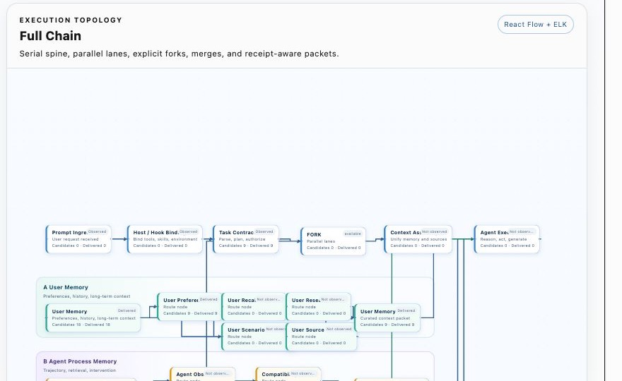
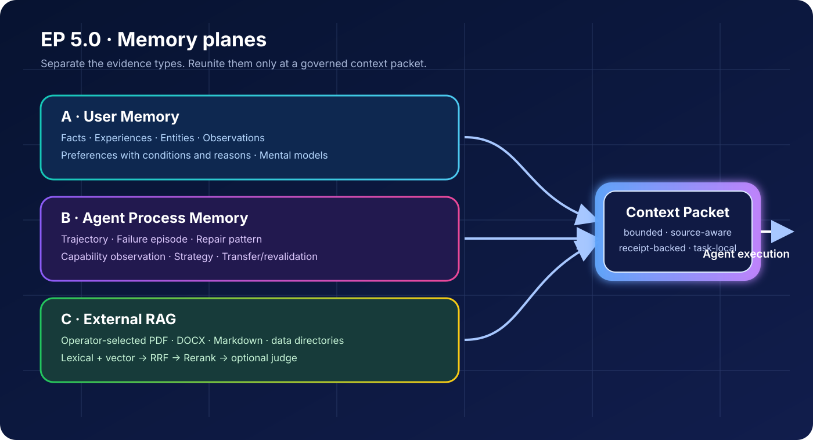
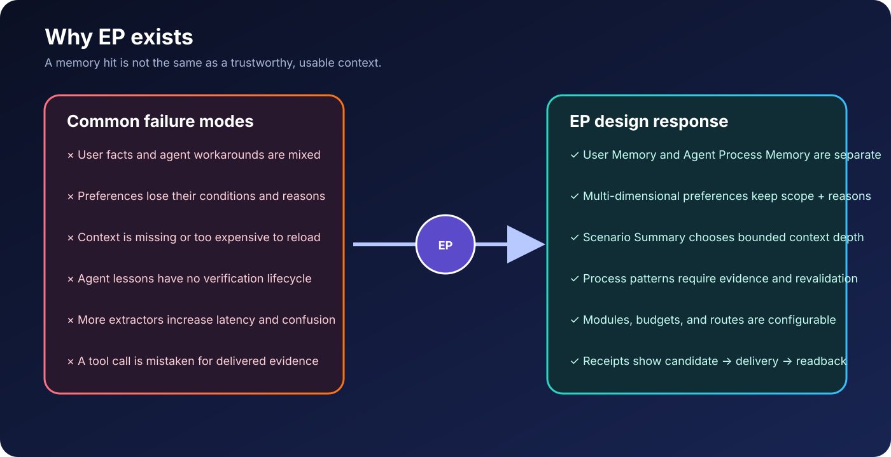
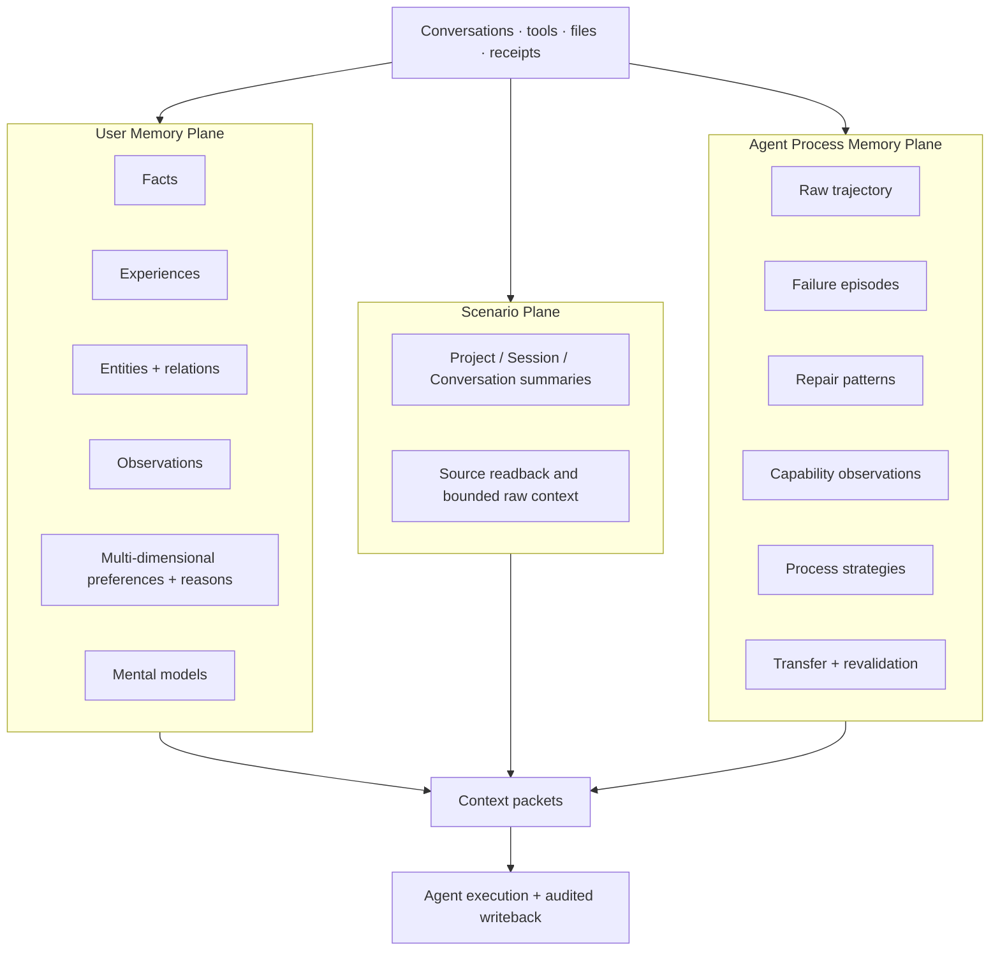
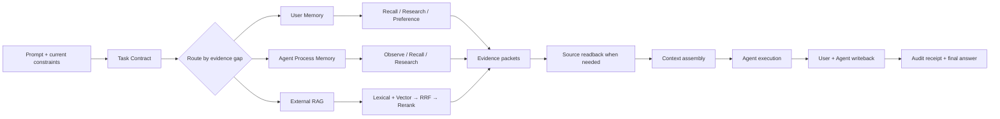
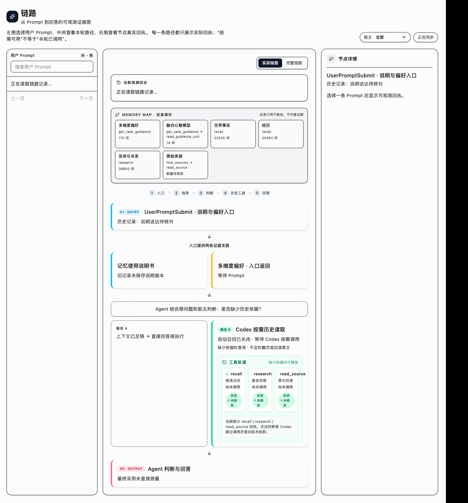
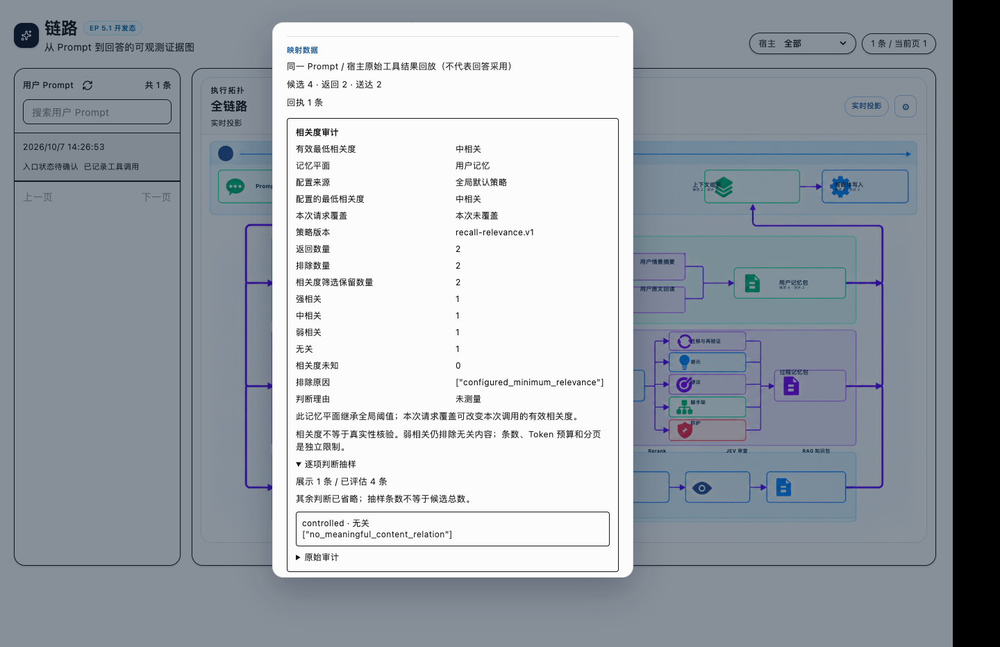

# Evolving Profile 5.1

<div align="center">

**Memory that knows what is true, what was tried, and what the agent should do next.**

Evidence-aware memory for AI agents — with user knowledge, agent process memory, source-grounded retrieval, and a visible execution chain.


<a href="https://github.com/94Hao94/evolving-profile">Evolving Profile upstream</a> ·
<a href="#quick-start">Quick start</a> ·
<a href="#how-ep-thinks">How EP thinks</a> ·
<a href="#why-ep">Why EP</a>

</div>

> **English is the default documentation and UI language. Simplified Chinese documentation follows this English section.**

**Chinese documentation:** [README-中文.md](README-中文.md)


EP 5.1 is the release-ready refinement of the 5.0 control plane: it keeps the
three memory planes and receipt contract, then hardens long-session coverage,
source-linked scenario state, agent-research projection, and release-grade
verification. The new release banner above is an architectural illustration,
not a screenshot or a claim about runtime data.

Evolving Profile (EP) is a long-term memory, evidence, and observability control plane for AI agents. It does not treat a similarity hit as a fact. Instead, it keeps navigation, retrieval, source readback, delivery, and answer-side uncertainty as separate auditable states.

This contribution package is a sanitized, re-initializable distribution. It contains no personal Bank, conversation history, API key, private prompt, hosted account, or production receipt. A new installation starts with an empty user memory store and lets the operator configure its own provider, storage, and external RAG directory.



*The screenshot is a sanitized console view of the serial spine, parallel memory lanes, explicit forks/merges, and receipt-aware packets. The live UI can open a detail card for every node and show its actual candidate, returned, delivered, source-readback, and answer-use state.*





## The short version

Most memory layers answer **“what looks similar?”** EP is built to answer four harder questions:

1. **What kind of knowledge is this?** A fact, an experience, an entity, a preference, a scenario, an external document, or an agent-process lesson?
2. **Which route found it?** User Recall, User Research, User Preference, Agent Recall, Agent Research, or External RAG?
3. **What evidence actually arrived?** Candidate, returned, delivered, source-read, and answer-use are separate states.
4. **Can this lesson be reused safely?** Agent-process patterns carry scope, verifier quality, model compatibility, counterexamples, and revalidation state.

EP is therefore not “a bigger vector database”. It is a **memory control plane**: a system that keeps knowledge, evidence, routing, and execution history understandable to both the agent and the operator.

## Why conventional memory systems lose precision

Many memory designs start with a useful idea — save the conversation, embed it, and retrieve the nearest passages. The difficult failures usually happen one layer later:

### 1. User knowledge and agent experience are mixed together

The user's preferences, project facts, and personal history are not the same thing as an agent's failed tool call, debugging detour, or delivery lesson. If both are stored as undifferentiated “memories”, a model can mistake an agent's temporary workaround for a user preference, or treat a project-local decision as a universal fact.

### 2. A single extracted fact is not the whole meaning

Useful user memory needs multiple views at once:

- **Facts** describe a state, rule, claim, or constraint;
- **Experiences** preserve who did what, when, under which conditions, and with what result;
- **Entities and relations** connect people, projects, organizations, tools, and documents;
- **Observations** summarize repeated evidence without pretending that one event is a pattern;
- **Preferences** are separated into dimensions such as communication, explanation, decision, execution, delivery, permission, and acceptance — including conditions, exceptions, and the reason or evidence behind the preference;
- **Mental models** explain a stable cross-record pattern without replacing the underlying sources.

### 3. Context is missing even when the extracted item is correct

“Use a concise structure” or “Project X uses provider Y” can be technically correct and still be wrong in the current turn if the original Session, Conversation, or Project context is different. Reading the complete history every time is slow, expensive, and difficult to parallelize; reading only a compressed summary can lose the exact constraint that matters. EP therefore stores Scenario Summary as a context index and chooses the smallest sufficient depth: compact, standard, full, bounded Session/Project history, or source readback.

### 4. Agent lessons need their own dimensions and lifecycle

An agent does more than produce text. It plans, calls tools, observes failures, repairs code, verifies output, manages context, and delivers an artifact. Those lessons need separate process dimensions and maturity states. Otherwise a “successful answer” can be promoted before it was independently verified, or a workaround from one model can be forced onto a better model later.

### 5. More dimensions can create a new problem

Perfect separation is not the goal. Too many always-on extractors can increase latency, token usage, and routing confusion. EP treats dimensions as configurable modules with dependency-aware switches, adaptive candidate budgets, bounded drill-down, and explicit “not observed” states. You can keep the model rich without paying for every layer on every turn.

## EP's answer: layered memory without fragmented reasoning



The planes are parallel in storage and retrieval, but they meet at a governed context packet. This is the balance: **more precise memory objects, one coherent decision point**.

## Personalization is a feature, not a compromise

EP lets an operator decide how much memory machinery is appropriate for a deployment:

- enable or disable Facts, Experiences, Entities, Preferences, Scenario Summary, source readback, and background reflection independently;
- enable or disable Agent trajectory, observation, failure episode, repair pattern, capability, strategy, and revalidation modules independently;
- set separate token budgets for preferences, scenarios, source readback, EP retrieval, and external RAG;
- keep recording while disabling retrieval or injection when a module is not wanted in the current environment;
- use adaptive candidate limits so a simple task stays light while a cross-project investigation can expand deliberately.

The result is not “maximum memory on every prompt”. It is **the smallest useful memory route for this task, with a receipt explaining what happened**.

## Real chain observability

EP treats observability as part of the memory contract, not as a log viewer added afterward. The topology distinguishes:

```text
not called ≠ called and empty ≠ returned ≠ delivered ≠ source-read ≠ answer-use confirmed
```

Every node can expose its own detail card: route name, timing, candidate count, returned count, delivered count, source IDs, readback count, fallback source, and unresolved boundary. This is how an operator can debug “the memory was relevant but never arrived” without guessing from a final answer.

## Built with gratitude, developed independently

EP began from the practical foundation and open ideas around Hindsight — retain/recall/reflect, memory banks, observations, entities, and long-term agent memory. We are grateful to the Hindsight project and its researchers for making that direction concrete and inspectable. EP 5.0 then develops an independently governed control plane around those foundations: separate user and agent-process memory, scenario-aware routing, configurable modules, external-RAG isolation, and receipt-level execution observability. See [`NOTICE.md`](NOTICE.md) for the attribution boundary.

## Why EP

| If you only add… | You get… | EP adds… |
| --- | --- | --- |
| Conversation memory | A compressed history of what was said | Typed user knowledge with source, time, subject, scope, and lifecycle |
| Vector RAG | Similar chunks | Isolated routes, lexical/vector/RRF/Rerank options, source readback, and delivery receipts |
| A knowledge graph | Connected entities | Graph navigation plus evidence boundaries; an edge is never silently promoted to a fact |
| A task skill library | Reusable instructions | Agent-process episodes that record failure, repair, verifier quality, model compatibility, and revalidation |
| A prompt log | A timeline of calls | A full execution topology showing serial steps, parallel lanes, forks, merges, writeback, and audit |

### The promise

**EP helps an agent remember without making it blindly obey the past.** Current instructions and verified evidence stay above stale preferences or unverified process patterns. A stronger future model is not forced to imitate an older model; a weaker model can receive more structure only when evidence shows that structure helps.

## How EP thinks



The key design choice is the **evidence gap**. EP does not begin with “inject everything that matches”. It begins by asking what is missing: a stable preference, a single historical episode, a cross-session relationship, a source paragraph, or a process lesson. The route and depth follow that gap.

## What makes 5.0 different

5.0 adds the execution side to EP4's user-memory and evidence model:

- User Memory answers **what the user/world/project history contains**.
- Agent Process Memory answers **what an agent tried, where it failed, how it recovered, and how confidently that recovery transfers**.
- External RAG answers **what the operator's external documents say**.
- The topology answers **what actually happened this turn**.

These are deliberately separate planes. They can cooperate in one context packet, but they cannot silently overwrite one another.

## A practical comparison

EP is designed for teams that need both **memory quality** and **operational accountability**. The comparison below describes architectural emphasis, not a claim that other projects cannot be extended.

| Dimension | Conversation-first memory | Retrieval-first RAG | EP 5.0 |
| --- | --- | --- | --- |
| Primary question | What did we say? | Which chunk is similar? | What evidence is relevant, what route found it, and what can be trusted? |
| Memory shape | Usually one compressed history | Documents/chunks and vectors | Facts, Experiences, Entities, Observations, Preferences, Scenarios, Process Episodes, RAG documents |
| Agent execution lessons | Often mixed into history | Usually outside the memory model | Dedicated Agent Process Memory with maturity and compatibility gates |
| Retrieval visibility | Tool call may be opaque | Search score is visible | Candidate → returned → delivered → readback → answer-use states |
| Conflict handling | Model-dependent | Rank-dependent | Scope, time, source, project/session identity, and explicit unresolved state |
| Model evolution | Old summaries may dominate | Old embeddings may drift | Capability calibration, intervention levels, revalidation, downgrade, and deprecation |
| Operator experience | Logs or a memory viewer | Search UI | Full-chain topology, node detail cards, configuration panels, audit receipts |

## Proof, not hype

The 5.0 contribution is backed by a release gate rather than invented product numbers:

- **636** Python Host Adapter / Controller / Guidance / Status tests passed;
- **146** Console tests passed across 23 test files;
- **10** API Hermes template tests passed;
- production Console build, localization scan, release preflight, package verification, and secret/personal-data scan passed;
- the public package contains no personal Bank, private Prompt, API key, local receipt, or machine-specific user path.

The two skipped Python checks depend on a private rollback fixture that is intentionally not distributed. The current contribution is tracked in [PR #3](https://github.com/94Hao94/evolving-profile/pull/3); merge, tag, and GitHub Release are separate states.

## Read the project in this order

1. **This README** — the product idea, logic, boundaries, and quick start.
2. **[EP 5.0 Agent Process Memory PRD](docs/EP5.0-AGENT-PROCESS-MEMORY-PRD.md)** — process-memory model and lifecycle.
3. **[Execution Topology PRD](docs/EP5.0-EXECUTION-TOPOLOGY-PRD.md)** — serial/parallel/fork/merge rules and visual contract.
4. **[Route Contract](docs/EP-ROUTE-CONTRACT.md)** — canonical user and agent routes.
5. **[Source of Truth](config/source-of-truth.json)** — which store is authoritative for which fact.
6. **[Release Notes](docs/RELEASE-NOTES-5.0.0.md)** — migration, limits, and verification evidence.

## What is new in 5.1

EP 5.1 keeps the EP 5.0 architecture and makes its hardest operational paths
more resilient and auditable:

- **Long-session coverage without silent loss**: deterministic, same-turn-safe
  episode boundaries reduce per-episode pressure while preserving the complete
  original source. Source-linked fallback drafts remain review-gated rather
  than being published as facts.
- **Stricter intent-to-state accounting**: every substantive user request,
  correction, constraint, and answered request must point to an exact source
  message and an actual state field. User corrections cannot be misclassified
  as assistant reports or silently mapped to a later message.
- **Independent native review provenance**: when an independent agent reviews
  source coverage, the receipt marks that transport explicitly and does not
  fabricate a background API request, response hash, or model identity.
- **Agent Research projection repair**: nested MCP envelopes are unwrapped
  without copying parent aggregates into child nodes; the topology now keeps
  agent recall, agent research, returned content, source readback, and answer
  use visibly distinct.
- **Evidence-aware fallback behavior**: malformed provider state can create a
  bounded source-linked candidate for review, but publication still requires
  exact partition, role, quote, summary-tier, and CAS checks.
- **Release-safe localization and packaging**: English remains the public
  default, Simplified Chinese remains available, dynamic route labels stay
  canonical, and the package excludes personal Banks, prompts, receipts, keys,
  and machine paths.

The detailed change record is in [`CHANGELOG-5.1.md`](CHANGELOG-5.1.md), and
the release evidence is in [`docs/RELEASE-NOTES-5.1.0.md`](docs/RELEASE-NOTES-5.1.0.md).

## What was new in 5.0

This release is the 5.0 architecture and runtime package. It keeps the validated 4.0 user-memory model and compatibility routes, and adds a first-class Agent Process Memory plane plus full-chain execution observability.

- **Agent Process Memory** is a separate memory plane for execution trajectories, failures, repairs, capability observations, conditional patterns, and revalidation. It does not overwrite user facts or preferences.
- **Full-chain topology** presents the serial entry spine, three parallel lanes (User Memory, Agent Process Memory, External RAG), explicit forks and merges, writeback, audit, and final response. Node counts are projected from the node's own receipts instead of copying a parent total into every child.
- **Canonical route names** make the source of a result obvious: `user_recall`, `user_research`, `user_preference`, `user_scenario_summary`, `user_source_readback`, `agent_recall`, `agent_research`, `agent_guidance`, `agent_observe`, `agent_writeback`, and `agent_evaluation`. Legacy tool names remain compatibility aliases.
- **Prompt receipt loading** now shows an explicit loading state and distinguishes “not loaded yet” from “loaded and empty”. A slow status service falls back to local hook receipts and prompt-ingress records without treating a local filesystem lookup as an EP Recall result.
- **Branch-accurate accounting** keeps candidate, returned, delivered, readback, and answer-use status independent for each node. A parent lane aggregate no longer makes unrelated child nodes appear to have the same four or six records.
- **Agent memory module switches** allow trajectory, observation, failure episode, repair pattern, capability, strategy, and revalidation recording/retrieval/injection to be enabled independently. Disabling retrieval prevents injection while preserving existing records.
- **Global localization coverage** uses English as the default and supports Simplified Chinese plus the existing locale set. Runtime/API/status text has the same locale fallback rules as the console, and the locale audit prevents newly added hard-coded interface text from silently bypassing translation.
- **Model and RAG configuration** keeps Provider/Fallback, Embedding, Rerank, RRF, index signatures, and JEV optional review separate. EP Bank memory and external RAG remain isolated routes.
- **Backup policy controls** cover target location, daily/weekly/monthly schedule, retention days, maximum sets, minimum successful sets, SHA-256 manifests, and separate cloud-mirror verification.
- **Single source of truth** marks product release metadata, runtime configuration, guidance configuration, backup configuration, user memory, agent-process memory, raw sessions, and external RAG as separate authorities. Console/API views are read-only projections, not competing configuration stores.

The detailed change record is in [`CHANGELOG-5.0.md`](CHANGELOG-5.0.md). The 4.0 and 3.0 records remain available in [`CHANGELOG-4.0.md`](CHANGELOG-4.0.md) and [`CHANGELOG-3.0.md`](CHANGELOG-3.0.md). The release process and evidence ledger are documented in [`docs/RELEASING.md`](docs/RELEASING.md) and [`docs/RELEASE-LEDGER.md`](docs/RELEASE-LEDGER.md).

## Architecture at a glance

EP is intentionally split into planes with different evidence responsibilities:

| Plane | Purpose | Examples | Can it replace source evidence? |
| --- | --- | --- | --- |
| User Memory | Long-lived user and world knowledge | Facts, Experiences, Entities, Observations, Preferences, Mental Models | No |
| Agent Process Memory | How an agent solved, failed, repaired, and verified work | Trajectory, Failure Episode, Repair Pattern, Capability Observation, Skill candidate | No; it is conditional guidance |
| Task Working Plane | The current prompt, contract, stage, and working state | Prompt ingress, Task Contract, Context Assembly | Only for the current task |
| External Evidence/RAG | User-selected documents outside EP Bank | PDF, DOCX, Markdown, lexical/vector/RRF/Rerank results | No; source files remain authoritative |
| Audit Plane | Immutable-ish receipts and operational status | Tool calls, delivery, source readback, configuration drift | No; it describes what happened |

The stable rule is:

```text
source evidence -> structured memory -> bounded candidates -> source readback -> answer
```

Upper layers never silently overwrite lower-layer evidence. A candidate is not a fact, a tool call is not proof that the answer used the result, and an unavailable receipt is not the same as an empty result.

## Runtime chain and topology

The console visualizes the chain below. The lanes run in parallel only where the runtime can genuinely run them in parallel; the serial spine controls entry, contract creation, context assembly, execution, writeback, audit, and final response.

```text
Prompt ingress -> Host/Hook binding -> Task Contract -> FORK
    |-> User Memory: L0/Preference -> User Recall / User Research
    |                    -> Scenario Summary / Source Readback -> User Memory Packet
    |-> Agent Process Memory: Observe -> Process Recall/Research
    |                    -> Compatibility/Maturity -> Hint/Recommend/Scaffold/Guard
    |                    -> Process Memory Packet
    |-> External RAG: Source Routing -> lexical + vector -> RRF -> Rerank -> optional JEV
                         -> RAG Packet
MERGE -> Context Assembly / Agent Execution -> User Writeback + Agent Writeback
      -> Audit Receipt -> Final Response
```

Every node owns its receipt projection. The UI displays candidates discovered, results returned, content delivered, source readback count, answer-side use when independently observable, and an explicit `observed`, `not observed`, `unavailable`, or `pending refresh` state. Clicking a node opens the exact detail card and source IDs behind the number.



*A real localized console capture: the map exposes large indexed-memory counts,
the route branches, and the evidence path. It is included as UI evidence, not as
a synthetic benchmark or a claim that every prompt should call every route.*



*The detail card makes relevance thresholds, returned/excluded counts, reasons,
and policy version inspectable instead of hiding them behind a final answer.*

This prevents the earlier failure mode where every child node displayed the same parent count. It also keeps a route that was not called visibly different from a route that was called and returned zero rows.

## User Memory

The user plane retains the EP4 model:

- **Facts**: source-supported statements, state, rules, and constraints;
- **Experiences**: events with subject, time, context, process, result, and source;
- **Entities and relations**: people, projects, organizations, files, agents, aliases, and evidence-scoped links;
- **Observations**: patterns derived from multiple independent records;
- **Multi-dimensional Preferences**: communication, explanation, decision, execution, delivery, permission, and acceptance constraints;
- **Scenario Summary**: compact/standard/full navigation context for Project and Session/Conversation;
- **Mental Models**: versioned, bounded high-level interpretations.

Preferences are conditional guidance, not a global instruction override. The current user prompt, current project/session constraints, and verified source evidence remain higher priority. A one-off behavior, a test sentence, or the assistant's own suggestion cannot silently become a global preference.

### Scenario Summary and source readback

Scenario Summary is a navigation layer, not a replacement for raw history:

```text
compact -> standard -> full -> bounded Session/Project history -> read_source when the field still matters
```

Use `read_source` for exact wording, amounts, versions, people, status, conflicts, or other consequential facts. Use bounded Session/Project history when the missing information is the sequence or rationale of the work. Do not inject an entire project merely because a summary is incomplete.

## Agent Process Memory

Agent Process Memory is deliberately separate from user memory because “what the user is” and “how an agent solved a task” have different lifecycles and safety rules.

### Process layers

```text
P0 Trace -> P1 Event -> P2 Failure Episode -> P3 Repair Pattern -> P4 Skill candidate
```

The process plane records raw trajectory and observable tool/action events; failure symptoms, diagnosis, repair, and verification; reusable patterns with preconditions and counterexamples; capability observations with sample count, time window, verifier quality, and confidence interval; and rollout/revalidation history when a model, tool, project, or environment changes.

The runtime intervention ladder is adaptive:

```text
observe -> hint -> recommend -> scaffold -> guard
```

Strong models are not identified by a permanent “strong/weak” list. The capability profile is conditioned on model identity, role, task family, stage, tools, verifier quality, recent results, sample size, time window, and distribution shift. A new model starts with light hints, is calibrated on a small sample, and receives more structure only when evidence shows it helps. Old patterns can be downgraded, deprecated, or revalidated and cannot suppress a stronger new model.

## Retrieval and external RAG

EP retrieval and external RAG are different routes:

- **User Recall/Research** searches EP's structured Bank and source index.
- **Agent Recall/Research** searches process memory and graph-linked execution evidence.
- **External RAG** searches only the operator-selected directory and its derived indexes.

External RAG supports lexical search, local or online Embedding, vector search, Reciprocal Rank Fusion (RRF), optional Rerank, score thresholds, and index signatures. Changing an embedding model, dimensions, or path marks the affected collection `rebuild_required`; the system never pretends old vectors are compatible with a new model.

JEV is an optional post-processing judge/router. It is not a recall engine and does not write facts. When enabled it can review evidence sufficiency, route EP versus RAG, classify a retrieval failure stage, or gate a high-risk action. When disabled or unavailable, deterministic rules and an explicit unknown state remain the fallback.

## Configuration, providers, and backups

The web console separates General overview; data and routing protection; runtime and per-module switches; EP user-memory modules; Agent Process Memory modules; retrieval/judge model profiles; providers and fallback; external RAG directory and index settings; Scenario Summary policy; backup policy; audit logs; and LLM requests.

Provider credentials are configured locally and are never committed. The distribution includes `.env.example`, not a real key. A primary provider can have a fallback provider; status cards show model name, last test, and failure cause without revealing the secret.

Backups are configurable rather than hard-coded: choose the local directory, schedule, retention days, maximum sets, minimum successful sets, checksum manifest, and cloud-mirror verification independently. A failed cloud mirror is visible as an issue; it does not silently erase a verified local backup.

## Installation and dependencies

The package is a monorepo with Python services and a Next.js console.

### Requirements

- macOS or Linux;
- Python 3.11+ with `uv` (or a compatible virtual environment);
- Node.js 20+ and npm;
- PostgreSQL for the full API data plane;
- optional local model runtime for Embedding or Rerank;
- an OpenAI-compatible, Anthropic-compatible, Codex, or other configured provider for LLM work.

### Quick start

```bash
cp .env.example .env
cd api && uv sync
cd ../console && npm ci
cd ..
npm run dev
```

Initialize the API/database using `api/README.md`, then open the console route for the selected Bank. The distribution never assumes a personal Bank path; configure a new Bank and storage root explicitly.

### One-command local deployment

For a fresh macOS/Linux checkout, the supported one-command path is:

```bash
./scripts/install-ep51.sh --mode local
```

The installer performs a preflight, creates an ignored local `.env` from
`.env.example` when needed, installs Python/Node dependencies when the package
manager is available, builds the Console, and writes a local launch manifest.
It never enables JEV, cloud backup, or an external RAG directory by itself, and
it never copies a production Bank or API key. Use `--dry-run` to inspect the
commands, `--skip-deps` when dependencies are already installed, and
`--no-launch` when you only want a verified build. Provider, database, RAG,
backup, and locale settings remain explicit operator configuration.

### Validation commands

```bash
python3 -m unittest scripts/test_release_preflight.py
python3 scripts/release-preflight.py --json
./scripts/verify-package.sh
cd console && npm test && npm run build
git diff --check
```

The release gate also runs the relevant Python Host Adapter, Controller, Guidance, API, and topology contract tests. Browser validation covers loading, empty, error, fallback, click-detail, scroll, and narrow-viewport states. Exact results belong in the current release notes; historical test counts are not reused as current evidence.

## Host compatibility

EP is designed as a host-neutral memory control plane rather than a single-chat
plugin. The current 5.1 package is highly compatible with:

| Host | Current 5.1 path | What is shared | Next-version direction |
| --- | --- | --- | --- |
| Codex | Native MCP/Hook receipts and the Console flow page | User/Agent routes, source-bound packets, receipt projection, scenario summaries | Deeper host-side answer-use and native process-review binding |
| Claude Code | Transcript/Hook bridge into the same controller and retention path | Session normalization, recall/research, source readback, agent-process routing | More native transcript lifecycle and setup diagnostics |
| Hermes | OpenAI-compatible service/MCP route with shared state/config contracts | Bank, provider fallback, RAG/JEV switches, audit schema | First-class installer and capability probes for Hermes deployments |

“Compatible” here means the shared contracts and adapters are available; it does
not claim identical host receipts or identical answer-use visibility. Codex is
the most deeply exercised host in 5.1. The next version will improve host
onboarding, per-host diagnostics, and native receipt coverage for Claude Code and
Hermes.

## Why this README is structured this way

The public documentation follows a practical open-source path: explain the pain
first, show the system logic, give a real data-rich UI proof, then provide
environment/deployment instructions, customization boundaries, migration,
security, and known limits. That makes EP understandable to a new operator
without exposing private prompts or pretending that a screenshot is a benchmark.
The Chinese README replaces the diagrams and evidence screenshots with localized
labels so the visual explanation matches the selected language.

## Privacy, compatibility, and limits

- The public package is sanitized; never copy `~/.evolving-profile`, `~/.codex/sessions`, production receipts, caches, API keys, or personal Bank data into this repository.
- EP can verify tool calls, returned candidates, delivery, and source readback. It generally cannot prove that an opaque Agent used a particular candidate in its final prose unless the host emits an answer-use receipt.
- Scenario Summary and process patterns are navigation/guidance layers. They do not replace source documents.
- Legacy route names remain compatibility aliases, but new integrations should use the canonical route registry.
- RAG, JEV, cloud mirror, and high-risk confirmation gates remain independently configurable; turning them off does not delete user memory.

## Contribution and release status

This package is prepared on the `release/5.1.0` contribution branch for the upstream [`94Hao94/evolving-profile`](https://github.com/94Hao94/evolving-profile), with the sanitized branch hosted in [`ccygod/evolving-profile-2.2`](https://github.com/ccygod/evolving-profile-2.2). PR, merge, tag, and GitHub Release states are intentionally recorded separately in [`docs/RELEASE-LEDGER.md`](docs/RELEASE-LEDGER.md). The distribution author remains CCY; Hindsight and related research are acknowledged in [`NOTICE.md`](NOTICE.md) without implying that upstream projects are EP code contributors.

---
